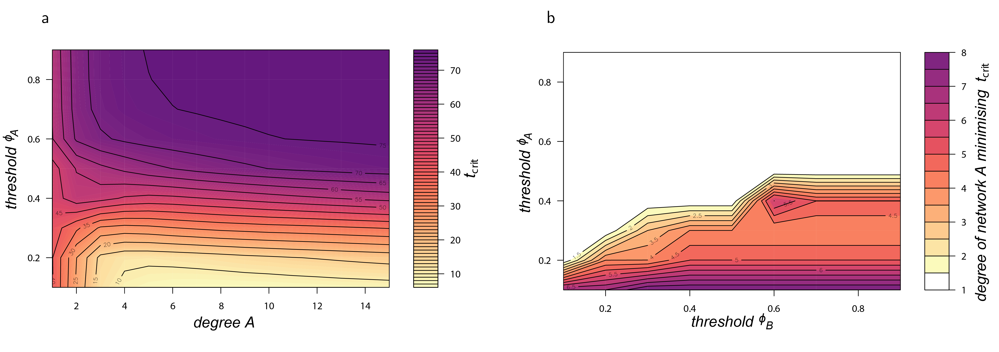

```{r setup, include=FALSE}
knitr::opts_chunk$set(echo = TRUE)
```
## Maths

This section lists some maths I use

## R

This section is about R

## Python

This section is about Python

## C++

This section is about C++

## R Markdown

These pages are created using [R Markdown](<http://rmarkdown.rstudio.com>) with [RStudio](https://www.rstudio.com/) to authour HTML.


## A Plot

image:  


another one - for example:

```{r pressure, echo=FALSE}
plot(pressure)
```

